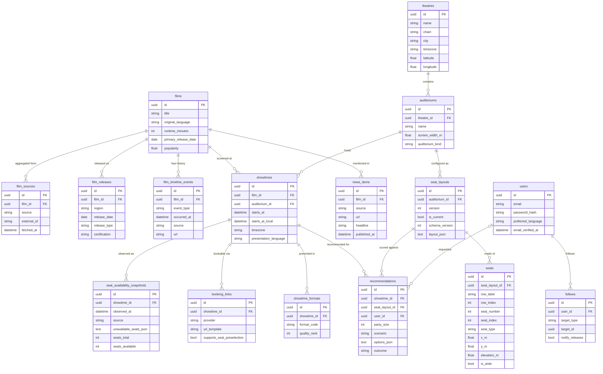

# Data Model

The complete GoldSeats schema. Sixteen core tables, built across
[M1](../product/milestones/M1.md) and [M2](../product/milestones/M2.md) and extended
through [M8](../product/milestones/M8.md).

This document is the specification. The Alembic migrations are the implementation, and if
they diverge from this file, **this file is wrong** and fixing it is part of the PR that
caused the divergence. Naming and migration rules are in
[`../engineering/database-conventions.md`](../engineering/database-conventions.md).

---

## Conventions applied to every table

| Rule | Value |
| --- | --- |
| Table names | `snake_case`, plural |
| Primary key | `id`, UUIDv7, `Uuid` type (native on Postgres, `CHAR(36)` on SQLite) |
| Foreign keys | `<singular>_id`, always indexed |
| Timestamps | `created_at`, `updated_at` — tz-aware, UTC, set in Python |
| Nullability | `NOT NULL` unless the null carries meaning, which is then documented |
| Enum-like columns | `String` + Python `StrEnum` + a `CHECK` constraint (no Postgres `ENUM` — SQLite parity) |
| JSON | `TEXT`, parsed in Python. Anything filterable is extracted into a real column. |
| Measurements | Unit in the column name (`screen_width_m`, `runtime_minutes`) |

"PK" = primary key, "FK" = foreign key, "UQ" = unique, "IX" = indexed.

---

## Entity relationship diagram



---

# Film catalog

## `films`

The canonical record for a motion picture, merged from all sources. One row per film,
regardless of how many sources describe it.

Populated by the TMDB ingestion job in [M1](../product/milestones/M1.md).

| Column | Type | Constraints | Notes |
| --- | --- | --- | --- |
| `id` | `Uuid` | PK, UUIDv7 | |
| `slug` | `String(160)` | UQ, NOT NULL | URL segment, e.g. `dune-part-three`. Generated from title + year; stable once assigned because it's in public URLs. |
| `title` | `String(255)` | NOT NULL, IX on `lower(title)` | Display title in `original_language` |
| `title_en` | `String(255)` | NULL | English title when it differs. NULL means "same as `title`". |
| `title_fr` | `String(255)` | NULL | French title. Canada is bilingual and the language selector depends on this. |
| `original_language` | `String(8)` | NOT NULL | ISO 639-1, e.g. `en`, `fr`, `ko` |
| `synopsis` | `Text` | NULL | |
| `synopsis_fr` | `Text` | NULL | |
| `runtime_minutes` | `Integer` | NULL | NULL for unreleased films with no announced runtime |
| `primary_release_date` | `Date` | NULL, IX | Canadian theatrical date if known, else earliest known. Denormalised from `film_releases` so the home page's release-date filter is one indexed comparison. |
| `status` | `String(32)` | NOT NULL, CHECK | `rumoured`, `planned`, `in_production`, `post_production`, `released`, `cancelled` |
| `poster_url` | `String(512)` | NULL | Absolute TMDB CDN URL at `w500` |
| `backdrop_url` | `String(512)` | NULL | |
| `popularity` | `Float` | NOT NULL, default `0.0`, IX | TMDB popularity, used as the default catalog sort |
| `vote_average` | `Float` | NULL | 0–10 |
| `vote_count` | `Integer` | NOT NULL, default `0` | |
| `genres` | `String(255)` | NOT NULL, default `''` | Comma-separated slugs. An array column would be nicer; SQLite doesn't have one and genres are display-only. |
| `created_at` | `DateTime(tz)` | NOT NULL | |
| `updated_at` | `DateTime(tz)` | NOT NULL | |

**Indexes:** `ix_films_lower_title` on `lower(title)` (Postgres; a plain index on SQLite),
`ix_films_primary_release_date`, `ix_films_popularity`, `ix_films_status`.

**Relationships:** → `film_sources`, `film_releases`, `film_timeline_events`, `showtimes`
(`RESTRICT`), `news_items`.

**Why `title_fr` and `synopsis_fr` are columns rather than a translations table:** we support
exactly two languages in the primary market, and a `film_translations` table would add a
join to every catalog query to serve a case we can enumerate. If we add a third language,
that's a migration and an ADR.

## `film_sources`

Provenance. One row per (film, source) pair, recording where our data came from and when we
last refreshed it. This is what makes the [M4](../product/milestones/M4.md) multi-source
timeline *verifiably* multi-source, and what makes TMDB attribution auditable under
[`../legal/data-sources-policy.md`](../legal/data-sources-policy.md).

| Column | Type | Constraints | Notes |
| --- | --- | --- | --- |
| `id` | `Uuid` | PK | |
| `film_id` | `Uuid` | FK → `films.id` `CASCADE`, NOT NULL, IX | |
| `source` | `String(32)` | NOT NULL, CHECK | `tmdb`, `manual`, `press_release`, `festival`, `news_feed` |
| `external_id` | `String(128)` | NOT NULL | The source's own ID, e.g. TMDB `693134` |
| `source_url` | `String(512)` | NULL | Canonical public URL at the source |
| `is_primary` | `Boolean` | NOT NULL, default `false` | The source we trust for conflicting fields. Exactly one per film, enforced in application code. |
| `fetched_at` | `DateTime(tz)` | NOT NULL | Last successful refresh |
| `raw_payload_json` | `Text` | NULL | Last response, for debugging an ingestion bug without re-fetching |
| `created_at` / `updated_at` | `DateTime(tz)` | NOT NULL | |

**Constraints:** `uq_film_sources_source_external_id` on `(source, external_id)` — this is
the idempotency key for ingestion. Re-running the TMDB job upserts rather than duplicating.

## `film_releases`

Release dates and certifications per region and release type. One film has many.

| Column | Type | Constraints | Notes |
| --- | --- | --- | --- |
| `id` | `Uuid` | PK | |
| `film_id` | `Uuid` | FK → `films.id` `CASCADE`, NOT NULL, IX | |
| `region` | `String(8)` | NOT NULL | ISO 3166-1 alpha-2. `CA` is the one we care about. |
| `release_date` | `Date` | NOT NULL, IX | |
| `release_type` | `String(32)` | NOT NULL, CHECK | `premiere`, `limited_theatrical`, `theatrical`, `digital`, `physical`, `tv` |
| `certification` | `String(16)` | NULL | Provincial rating, e.g. `G`, `PG`, `14A`, `18A`, `R`. Canadian ratings are provincial, so this is the Ontario rating unless `note` says otherwise. |
| `language` | `String(8)` | NULL | Release language when a region gets dubbed and subtitled releases on different dates |
| `note` | `String(255)` | NULL | e.g. "Quebec release, French dub" |
| `created_at` / `updated_at` | `DateTime(tz)` | NOT NULL | |

**Constraints:** `uq_film_releases_film_id_region_release_type_language`.

**Indexes:** `ix_film_releases_film_id_region`, `ix_film_releases_release_date`.

## `film_timeline_events`

The spine of the [M4](../product/milestones/M4.md) expandable timeline. Every dated thing
that ever happened to a film, from any source, in one chronological stream.

| Column | Type | Constraints | Notes |
| --- | --- | --- | --- |
| `id` | `Uuid` | PK | |
| `film_id` | `Uuid` | FK → `films.id` `CASCADE`, NOT NULL, IX | |
| `event_type` | `String(32)` | NOT NULL, CHECK | `announcement`, `casting`, `production`, `trailer`, `festival`, `review`, `release`, `award`, `news` |
| `occurred_at` | `DateTime(tz)` | NOT NULL, IX | When the event happened, not when we ingested it |
| `precision` | `String(16)` | NOT NULL, default `day`, CHECK | `day`, `month`, `year`. Historical events are often only known to the month; rendering "January 1st" for "sometime in January 2024" is a lie the UI shouldn't tell. |
| `title` | `String(255)` | NOT NULL | e.g. "Official trailer released" |
| `body` | `Text` | NULL | |
| `source` | `String(32)` | NOT NULL | Matches `film_sources.source` |
| `source_name` | `String(128)` | NULL | Human-readable publisher, shown as attribution |
| `url` | `String(512)` | NULL | Link out to the original |
| `media_url` | `String(512)` | NULL | Trailer or still image |
| `importance` | `Integer` | NOT NULL, default `50` | 0–100. Drives the collapsed view: the timeline shows high-importance events and hides the rest behind "show all". |
| `external_id` | `String(128)` | NULL | Source's ID, for deduplication |
| `created_at` / `updated_at` | `DateTime(tz)` | NOT NULL | |

**Constraints:** `uq_film_timeline_events_source_external_id` where `external_id` is not
null — deduplication across repeated ingestion runs.

**Indexes:** `ix_film_timeline_events_film_id_occurred_at` — the exact shape of the timeline
query.

---

# Theatres and seating

## `theatres`

A physical cinema. Hand-seeded in [M2](../product/milestones/M2.md), never scraped.

| Column | Type | Constraints | Notes |
| --- | --- | --- | --- |
| `id` | `Uuid` | PK | |
| `slug` | `String(160)` | UQ, NOT NULL | e.g. `cineplex-scotiabank-toronto` |
| `name` | `String(255)` | NOT NULL | e.g. "Cineplex Cinemas Scotiabank Theatre Toronto" |
| `chain` | `String(64)` | NOT NULL, CHECK | `cineplex`, `landmark`, `imagine`, `independent` |
| `address_line1` | `String(255)` | NOT NULL | |
| `city` | `String(128)` | NOT NULL, IX | |
| `province` | `String(8)` | NOT NULL | e.g. `ON`, `QC`, `BC` |
| `postal_code` | `String(16)` | NULL | |
| `country` | `String(8)` | NOT NULL, default `CA` | |
| `latitude` | `Float` | NOT NULL | For "playing nearby" |
| `longitude` | `Float` | NOT NULL | |
| `timezone` | `String(64)` | NOT NULL | IANA, e.g. `America/Toronto`. Every showtime in this theatre inherits it. |
| `website_url` | `String(512)` | NULL | |
| `booking_base_url` | `String(512)` | NULL | Chain's booking host, used to build and validate `booking_links` |
| `is_active` | `Boolean` | NOT NULL, default `true` | |
| `seeded_by` | `String(128)` | NOT NULL | Who hand-authored this record. Data provenance for manual data is a person's name. |
| `seeded_at` | `DateTime(tz)` | NOT NULL | |
| `created_at` / `updated_at` | `DateTime(tz)` | NOT NULL | |

**Indexes:** `ix_theatres_city`, `ix_theatres_latitude_longitude`.

Proximity search uses a bounding box on lat/long plus a Haversine filter in Python. PostGIS
would be better and doesn't exist in SQLite; with 5–10 seeded theatres the difference is
unmeasurable.

## `auditoriums`

A screening room inside a theatre. Its physical dimensions drive the scoring engine's
view-angle factor and the 3D scene's geometry.

| Column | Type | Constraints | Notes |
| --- | --- | --- | --- |
| `id` | `Uuid` | PK | |
| `theatre_id` | `Uuid` | FK → `theatres.id` `CASCADE`, NOT NULL, IX | |
| `name` | `String(64)` | NOT NULL | e.g. "Auditorium 3", "IMAX" |
| `auditorium_kind` | `String(32)` | NOT NULL, CHECK | `standard`, `large`, `small`, `imax`, `recliners`. **Matches the five theatre types in the dataset generator**, so seeded layouts are geometrically consistent with what the scoring model was tuned on. |
| `screen_width_m` | `Float` | NOT NULL | Direct input to the view-angle factor |
| `screen_height_m` | `Float` | NOT NULL | Used by the 3D view for true relative size |
| `screen_bottom_height_m` | `Float` | NOT NULL, default `1.5` | Height of the screen's bottom edge above the front-row floor. Determines vertical viewing angle. |
| `first_row_distance_m` | `Float` | NOT NULL | Front row to screen |
| `row_spacing_m` | `Float` | NOT NULL, default `1.1` | |
| `stadium_rise_m` | `Float` | NOT NULL, default `0.35` | Elevation gain per row |
| `row_curvature` | `Float` | NOT NULL, default `0.0` | 0 = straight rows, higher = more curve |
| `has_premium_centre` | `Boolean` | NOT NULL, default `false` | IMAX-style premium centre block |
| `total_seats` | `Integer` | NOT NULL | Denormalised from the current layout for cheap listing |
| `is_active` | `Boolean` | NOT NULL, default `true` | |
| `created_at` / `updated_at` | `DateTime(tz)` | NOT NULL | |

**Constraints:** `uq_auditoriums_theatre_id_name`.

## `seat_layouts`

A **versioned, immutable** seating configuration for an auditorium. Append-only: a theatre
converting to recliners produces version 2, and version 1 stays forever because
recommendations computed against it must remain interpretable.

| Column | Type | Constraints | Notes |
| --- | --- | --- | --- |
| `id` | `Uuid` | PK | |
| `auditorium_id` | `Uuid` | FK → `auditoriums.id` `CASCADE`, NOT NULL, IX | |
| `version` | `Integer` | NOT NULL | Monotonic per auditorium, starting at 1 |
| `is_current` | `Boolean` | NOT NULL, default `false` | The layout used for new recommendations. Exactly one true per auditorium, enforced in application code — a partial unique index would break SQLite. |
| `schema_version` | `Integer` | NOT NULL | Version of the `layout_json` document format, so the parser can read old documents |
| `layout_json` | `Text` | NOT NULL | The full geometry document. Canonical source; `seats` rows are the queryable projection of it. |
| `row_count` | `Integer` | NOT NULL | |
| `seat_count` | `Integer` | NOT NULL | |
| `effective_from` | `Date` | NOT NULL | When the theatre started using this configuration |
| `effective_to` | `Date` | NULL | NULL means "still in use" |
| `source_file` | `String(255)` | NOT NULL | Path of the committed seed JSON, e.g. `seeds/layouts/cineplex-scotiabank-toronto-aud-3.v1.json` |
| `notes` | `Text` | NULL | e.g. "Measured from published floor plan, cross-checked against the chain's seat picker, 2026-03-14" |
| `created_at` / `updated_at` | `DateTime(tz)` | NOT NULL | |

**Constraints:** `uq_seat_layouts_auditorium_id_version`.

`layout_json` is the one sanctioned JSON blob in the schema, because the geometry is
genuinely a document and is read whole or not at all. Everything queryable is projected
into `seats`.

```json
{
  "schema_version": 2,
  "auditorium_kind": "standard",
  "screen": { "width_m": 16.0, "height_m": 6.8, "bottom_height_m": 1.6 },
  "geometry": { "first_row_distance_m": 5.2, "row_spacing_m": 1.1, "stadium_rise_m": 0.35, "row_curvature": 0.12 },
  "aisles": [{ "after_seat_index": 3 }, { "after_seat_index": 16 }],
  "rows": [
    {
      "label": "A",
      "index": 0,
      "seats": [
        { "number": 1, "index": 0, "type": "regular", "x_m": -4.8, "is_aisle": true },
        { "number": 2, "index": 1, "type": "regular", "x_m": -4.25, "is_aisle": false }
      ]
    }
  ]
}
```

## `seats`

One row per physical seat in a layout version. The queryable projection of `layout_json`,
generated by the seeding CLI — never hand-edited, because two sources of truth for seat
geometry is how the seat map and the 3D view end up disagreeing.

| Column | Type | Constraints | Notes |
| --- | --- | --- | --- |
| `id` | `Uuid` | PK | |
| `seat_layout_id` | `Uuid` | FK → `seat_layouts.id` `CASCADE`, NOT NULL, IX | |
| `row_label` | `String(8)` | NOT NULL | What the theatre prints: `A`, `B`, `AA` |
| `row_index` | `Integer` | NOT NULL | 0-based from the screen. **Row `A` is index 0.** |
| `seat_number` | `Integer` | NOT NULL | What the theatre prints. 1-based. |
| `seat_index` | `Integer` | NOT NULL | 0-based within the row, for adjacency maths |
| `seat_type` | `String(32)` | NOT NULL, CHECK | `regular`, `recliner`, `wheelchair`, `companion` — the four types from the dataset generator |
| `x_m` | `Float` | NOT NULL | Metres from the centreline. Negative = house left. |
| `y_m` | `Float` | NOT NULL | Metres from the screen |
| `elevation_m` | `Float` | NOT NULL | Metres above the front-row floor |
| `is_aisle` | `Boolean` | NOT NULL, default `false` | Directly adjacent to an aisle |
| `is_premium` | `Boolean` | NOT NULL, default `false` | In a premium centre block |
| `is_bookable` | `Boolean` | NOT NULL, default `true` | `false` for permanently blocked seats (technician positions, broken seats) |
| `created_at` / `updated_at` | `DateTime(tz)` | NOT NULL | |

**Constraints:** `uq_seats_seat_layout_id_row_label_seat_number`,
`ck_seats_row_index_non_negative`, `ck_seats_seat_index_non_negative`.

**Indexes:** `ix_seats_seat_layout_id_row_index_seat_index` — the ordering the seat map and
the scoring engine both read in.

The 1-based/0-based duality is deliberate and is the schema's sharpest edge. Labels must
match what's printed on the seat, or a user sits in the wrong place. Geometry must be
0-based, or adjacency arithmetic is off by one. Keeping both explicit is safer than
converting at every boundary — see the review checklist in
[`../engineering/code-review.md`](../engineering/code-review.md).

---

# Showtimes and booking

## `showtimes`

A specific film, in a specific auditorium, at a specific time. Hand-seeded in
[M2](../product/milestones/M2.md).

| Column | Type | Constraints | Notes |
| --- | --- | --- | --- |
| `id` | `Uuid` | PK | |
| `film_id` | `Uuid` | FK → `films.id` `RESTRICT`, NOT NULL, IX | `RESTRICT`: deleting a film with showtimes is a data bug and should fail loudly |
| `auditorium_id` | `Uuid` | FK → `auditoriums.id` `CASCADE`, NOT NULL, IX | |
| `starts_at` | `DateTime(tz)` | NOT NULL, IX | **UTC, tz-aware.** The only column used for comparisons. |
| `starts_at_local` | `DateTime` | NOT NULL | Naive wall-clock time at the theatre. Stored so clients render "7:30 PM" without recomputing a timezone conversion. |
| `timezone` | `String(64)` | NOT NULL | IANA, copied from `theatres.timezone` at write time |
| `ends_at` | `DateTime(tz)` | NULL | `starts_at` + runtime + trailers, when known |
| `presentation_language` | `String(8)` | NOT NULL | Audio language of this screening. A French dub of an English film is a different showtime. |
| `subtitle_language` | `String(8)` | NULL | NULL = no subtitles |
| `is_accessible_described` | `Boolean` | NOT NULL, default `false` | Descriptive audio available |
| `is_accessible_captioned` | `Boolean` | NOT NULL, default `false` | Closed captioning available |
| `base_price_cents` | `Integer` | NULL | Indicative adult price. NULL when unknown — **we never quote a price we aren't sure of**, since we don't sell the ticket. |
| `currency` | `String(8)` | NOT NULL, default `CAD` | |
| `external_id` | `String(128)` | NULL | Chain's showtime ID, used to build deep links |
| `is_active` | `Boolean` | NOT NULL, default `true` | |
| `created_at` / `updated_at` | `DateTime(tz)` | NOT NULL | |

**Constraints:** `uq_showtimes_auditorium_id_starts_at` — one auditorium cannot run two
films at once, and this catches the most common seeding mistake.

**Indexes:** `ix_showtimes_film_id_starts_at`, `ix_showtimes_auditorium_id_starts_at`,
`ix_showtimes_starts_at`.

Storing the time three ways is redundant on purpose. Treating a naive datetime as UTC has
already produced one real bug, where every Toronto evening showtime shifted by four or five
hours depending on DST and "now playing" was wrong after 8pm.

## `showtime_formats`

The presentation formats a showtime is available in, and how good each one is. Drives the
"best way to experience this film" panel in [M4](../product/milestones/M4.md).

| Column | Type | Constraints | Notes |
| --- | --- | --- | --- |
| `id` | `Uuid` | PK | |
| `showtime_id` | `Uuid` | FK → `showtimes.id` `CASCADE`, NOT NULL, IX | |
| `format_code` | `String(32)` | NOT NULL, CHECK | `standard`, `imax`, `imax_70mm`, `dolby_cinema`, `dolby_atmos`, `ultraavx`, `vip`, `d_box`, `three_d`, `four_dx`, `screenx` |
| `quality_rank` | `Integer` | NOT NULL | 1 = best. Our editorial ranking of image and sound fidelity. |
| `is_premium` | `Boolean` | NOT NULL, default `false` | Carries a surcharge |
| `note` | `String(255)` | NULL | e.g. "1.43:1 aspect ratio, full IMAX frame" |
| `created_at` / `updated_at` | `DateTime(tz)` | NOT NULL | |

**Constraints:** `uq_showtime_formats_showtime_id_format_code`.

A showtime has many formats because a single screening is legitimately "IMAX + Dolby Atmos +
3D". The column is `format_code`, not `format`, because `format` is a SQL reserved word.

`quality_rank` is an editorial judgement, not a fact, and it's recorded as data so it's
reviewable and arguable rather than buried in a sort function.

## `booking_links`

The outbound deep link. This is where a user leaves GoldSeats, and it's the closest thing we
have to a revenue event.

| Column | Type | Constraints | Notes |
| --- | --- | --- | --- |
| `id` | `Uuid` | PK | |
| `showtime_id` | `Uuid` | FK → `showtimes.id` `CASCADE`, NOT NULL, IX | |
| `provider` | `String(64)` | NOT NULL | e.g. `cineplex` |
| `url_template` | `String(1024)` | NOT NULL | Deep link, with optional `{row}`/`{seats}` placeholders |
| `supports_seat_preselection` | `Boolean` | NOT NULL, default `false` | Whether the chain's URL can carry our seat choice through. When false, we hand off to the showtime page and tell the user which seats to pick. |
| `link_kind` | `String(32)` | NOT NULL, CHECK | `online_purchase`, `showtime_page`, `theatre_page` |
| `allowed_host` | `String(255)` | NOT NULL | Expected host, e.g. `www.cineplex.com`. **Validated against an allowlist before rendering.** |
| `last_verified_at` | `DateTime(tz)` | NULL | Last time someone confirmed the link resolves |
| `is_active` | `Boolean` | NOT NULL, default `true` | |
| `created_at` / `updated_at` | `DateTime(tz)` | NOT NULL | |

**Constraints:** `uq_booking_links_showtime_id_provider_link_kind`.

`allowed_host` exists because a seeded URL is user-visible outbound navigation, and an
unvalidated one is an open redirect with our brand on it. The host is checked against a
hardcoded allowlist at render time, not just at seed time. Flagged explicitly in the review
checklist.

## `seat_availability_snapshots`

A point-in-time observation of which seats are taken. Immutable; the newest row wins.

| Column | Type | Constraints | Notes |
| --- | --- | --- | --- |
| `id` | `Uuid` | PK | |
| `showtime_id` | `Uuid` | FK → `showtimes.id` `CASCADE`, NOT NULL, IX | |
| `observed_at` | `DateTime(tz)` | NOT NULL, IX | |
| `source` | `String(32)` | NOT NULL, CHECK | `manual`, `simulated`, `partner_api`. **Never `scraped`** — the absence of that value is the policy, expressed as a constraint. |
| `unavailable_seats_json` | `Text` | NOT NULL | `[{"row_label":"H","seat_number":12}, ...]`. Stores the unavailable set because it's the small one. |
| `seats_total` | `Integer` | NOT NULL | |
| `seats_available` | `Integer` | NOT NULL | Denormalised so "how full is this?" needs no JSON parsing |
| `confidence` | `String(16)` | NOT NULL, default `medium`, CHECK | `high`, `medium`, `low`. Drives how strongly the UI hedges. |
| `created_at` | `DateTime(tz)` | NOT NULL | No `updated_at` — snapshots are immutable |

**Indexes:** `ix_seat_availability_snapshots_showtime_id_observed_at` (descending
`observed_at`) — every read is "latest snapshot for this showtime".

Before [M2](../product/milestones/M2.md) ships a partner data path, availability is
`simulated` using the booking simulator from the dataset generator, with
`confidence = 'low'`, and the UI says so. Presenting simulated availability as real would be
the most damaging thing this product could do to its own credibility.

Retention: snapshots older than 30 days are pruned. The aggregate occupancy curve is worth
keeping; the per-seat detail isn't.

---

# Recommendations

## `recommendations`

A persisted scoring result. Persisted rather than computed-and-forgotten so that the 2D map,
the 3D view, the chatbot, and an in-person reservation all refer to the same recommendation
by ID.

| Column | Type | Constraints | Notes |
| --- | --- | --- | --- |
| `id` | `Uuid` | PK | Returned to the client and used in the booking handoff |
| `showtime_id` | `Uuid` | FK → `showtimes.id` `CASCADE`, NOT NULL, IX | |
| `seat_layout_id` | `Uuid` | FK → `seat_layouts.id` `RESTRICT`, NOT NULL, IX | Which layout version this was scored against |
| `seat_availability_snapshot_id` | `Uuid` | FK → `seat_availability_snapshots.id` `SET NULL`, NULL, IX | The availability it was computed from. Makes a recommendation reproducible. |
| `user_id` | `Uuid` | FK → `users.id` `SET NULL`, NULL, IX | **NULL is normal** — recommendations work anonymously, and `SET NULL` is how account deletion preserves aggregate data without retaining identity |
| `party_size` | `Integer` | NOT NULL, CHECK 1–12 | |
| `scenario` | `String(32)` | NOT NULL, CHECK | `solo`, `pair`, `small_group`, `large_group`, `family`. Derived server-side from `party_size`; never sent by the client. |
| `preferences_json` | `Text` | NOT NULL | The request's soft constraints, verbatim |
| `options_json` | `Text` | NOT NULL | Ranked options: seats, score, per-factor breakdown, explanation |
| `top_score` | `Float` | NULL | Denormalised rank-1 score for analytics. NULL when no options were found. |
| `option_count` | `Integer` | NOT NULL | 0 when the party can't be seated contiguously |
| `empty_reason` | `String(32)` | NULL, CHECK | `no_contiguous_block`, `sold_out`, `no_accessible_seating`. Non-null only when `option_count = 0`. |
| `scoring_version` | `String(32)` | NOT NULL | Version of `app/ml/scoring.py` and its weights. **Essential** — without it, a stored score from March can't be compared to one from June. |
| `duration_ms` | `Float` | NOT NULL | Scoring time, feeding the 50ms budget |
| `outcome` | `String(32)` | NOT NULL, default `pending`, CHECK | `pending`, `booked_online`, `reserved_in_person`, `abandoned` |
| `selected_seats_json` | `Text` | NULL | What the user actually chose, which is not always our rank-1 — the most valuable training signal in the whole schema |
| `source` | `String(32)` | NOT NULL, default `web`, CHECK | `web`, `chat`. Distinguishes chatbot-driven recommendations. |
| `created_at` / `updated_at` | `DateTime(tz)` | NOT NULL | |

**Indexes:** `ix_recommendations_showtime_id_created_at`,
`ix_recommendations_user_id_created_at`, `ix_recommendations_outcome`.

`options_json` is a blob because it's a nested result document that is always read whole and
never filtered. Everything we query — `top_score`, `option_count`, `empty_reason`,
`outcome` — is a real column.

`selected_seats_json` versus `options_json` is the dataset that eventually improves the
weights: every divergence between what we recommended and what a human actually picked is a
labelled example.

---

# Users and social

## `users`

| Column | Type | Constraints | Notes |
| --- | --- | --- | --- |
| `id` | `Uuid` | PK | |
| `email` | `String(320)` | UQ, NOT NULL | Stored lowercased. Uniqueness is on the lowercased value. |
| `password_hash` | `String(255)` | NULL | Argon2id. NULL for OAuth-only accounts. |
| `display_name` | `String(128)` | NULL | |
| `preferred_language` | `String(8)` | NOT NULL, default `en` | Default for the language selector |
| `preferred_city` | `String(128)` | NULL | Default for "playing nearby" |
| `email_verified_at` | `DateTime(tz)` | NULL | NULL = unverified |
| `oauth_provider` | `String(32)` | NULL, CHECK | `google`, `apple`, `github` |
| `oauth_subject` | `String(255)` | NULL | Provider's stable subject ID |
| `notify_email_enabled` | `Boolean` | NOT NULL, default `true` | |
| `notify_push_enabled` | `Boolean` | NOT NULL, default `false` | Opt-in |
| `push_subscription_json` | `Text` | NULL | Web Push subscription |
| `last_seen_at` | `DateTime(tz)` | NULL | |
| `created_at` / `updated_at` | `DateTime(tz)` | NOT NULL | |

**Constraints:** `uq_users_email`, `uq_users_oauth_provider_oauth_subject`,
`ck_users_has_a_credential` — `password_hash IS NOT NULL OR oauth_subject IS NOT NULL`.

**No soft delete.** Account deletion hard-deletes the row, because a tombstone holding an
email address forever is not deletion. See
[`../legal/privacy-policy.md`](../legal/privacy-policy.md) and the deletion rules in
[`../engineering/database-conventions.md`](../engineering/database-conventions.md).

## `follows`

Polymorphic follow edges: films, theatres, people. [M8](../product/milestones/M8.md).

| Column | Type | Constraints | Notes |
| --- | --- | --- | --- |
| `id` | `Uuid` | PK | Surrogate key so `DELETE /v1/me/follows/{id}` is trivial |
| `user_id` | `Uuid` | FK → `users.id` `CASCADE`, NOT NULL, IX | |
| `target_type` | `String(32)` | NOT NULL, CHECK | `film`, `theatre`, `person` |
| `target_id` | `Uuid` | NOT NULL, IX | **No FK** — polymorphic. Referential integrity is enforced in application code. |
| `notify_releases` | `Boolean` | NOT NULL, default `true` | |
| `notify_local_showtimes` | `Boolean` | NOT NULL, default `true` | |
| `notify_news` | `Boolean` | NOT NULL, default `false` | News is high-volume; opt-in |
| `created_at` / `updated_at` | `DateTime(tz)` | NOT NULL | |

**Constraints:** `uq_follows_user_id_target_type_target_id`. A duplicate follow is a `409`.

**Indexes:** `ix_follows_target_type_target_id` — "who follows this film" drives notification
fan-out.

The polymorphic `target_id` with no foreign key is a deliberate trade: three separate tables
would be more correct and would triple the feed query. A scheduled integrity check flags
orphans. `person` targets have no table yet; that arrives with [M8](../product/milestones/M8.md)
cast and crew ingestion, and until then the `CHECK` permits the value but nothing writes it.

## `news_items`

Aggregated film news. Feeds both the unified feed in [M8](../product/milestones/M8.md) and
`news`-type rows in `film_timeline_events`.

| Column | Type | Constraints | Notes |
| --- | --- | --- | --- |
| `id` | `Uuid` | PK | |
| `film_id` | `Uuid` | FK → `films.id` `CASCADE`, NULL, IX | NULL for industry news with no single subject film |
| `source` | `String(64)` | NOT NULL | Publisher slug |
| `source_name` | `String(128)` | NOT NULL | Display name, shown as attribution |
| `external_id` | `String(255)` | NULL | Publisher's ID or GUID |
| `url` | `String(1024)` | NOT NULL | Canonical article URL |
| `headline` | `String(512)` | NOT NULL | |
| `summary` | `Text` | NULL | **Our own short summary or a licensed excerpt.** Never the full article body — see [`../legal/data-sources-policy.md`](../legal/data-sources-policy.md). |
| `image_url` | `String(512)` | NULL | Only when the feed explicitly provides one for syndication |
| `author` | `String(255)` | NULL | |
| `published_at` | `DateTime(tz)` | NOT NULL, IX | |
| `language` | `String(8)` | NOT NULL, default `en` | |
| `ingested_at` | `DateTime(tz)` | NOT NULL | |
| `created_at` / `updated_at` | `DateTime(tz)` | NOT NULL | |

**Constraints:** `uq_news_items_url`, plus
`uq_news_items_source_external_id` where `external_id` is not null.

**Indexes:** `ix_news_items_film_id_published_at`, `ix_news_items_published_at`.

We store headline, link, attribution, and a short summary — enough to be a useful feed, not
enough to be a substitute for the publisher's page. That's a copyright boundary, not a
storage optimisation.

---

## Tables added after the core sixteen

Specified here so the schema's eventual shape is clear, created in their own milestones:

| Table | Milestone | Purpose |
| --- | --- | --- |
| `chat_conversations` | [M7](../product/milestones/M7.md) | One per chat session: `user_id` (nullable), `showtime_id`, model name, `created_at` |
| `chat_messages` | [M7](../product/milestones/M7.md) | `conversation_id`, `role` (`user`/`assistant`/`tool`), content, `tool_calls_json`, token counts, latency |
| `watchlist_entries` | [M8](../product/milestones/M8.md) | `user_id`, `film_id`, `state` (`want_to_see`/`seen`), `seen_at`, `rating` |
| `notifications` | [M8](../product/milestones/M8.md) | Dispatch log, for idempotency and to avoid notifying twice |

They follow every convention above, including cascade-on-user-delete.

---

## Cascade summary

| Foreign key | `ondelete` | Reasoning |
| --- | --- | --- |
| `film_sources.film_id` | `CASCADE` | Provenance is meaningless without the film |
| `film_releases.film_id` | `CASCADE` | |
| `film_timeline_events.film_id` | `CASCADE` | |
| `news_items.film_id` | `CASCADE` | |
| `auditoriums.theatre_id` | `CASCADE` | |
| `seat_layouts.auditorium_id` | `CASCADE` | |
| `seats.seat_layout_id` | `CASCADE` | |
| `showtimes.film_id` | `RESTRICT` | Deleting a film that has showtimes is a bug; fail loudly |
| `showtimes.auditorium_id` | `CASCADE` | |
| `showtime_formats.showtime_id` | `CASCADE` | |
| `booking_links.showtime_id` | `CASCADE` | |
| `seat_availability_snapshots.showtime_id` | `CASCADE` | |
| `recommendations.showtime_id` | `CASCADE` | |
| `recommendations.seat_layout_id` | `RESTRICT` | A layout version with recommendations against it must not vanish |
| `recommendations.user_id` | `SET NULL` | Anonymous recommendations are valid; this is how account deletion works |
| `follows.user_id` | `CASCADE` | |

SQLite does not enforce foreign keys unless `PRAGMA foreign_keys=ON` is set per connection,
which we do — otherwise local development silently permits orphans that production rejects.

---

## Open schema questions

Written down rather than decided prematurely:

- **`showtime_formats.quality_rank` as data vs. code.** It's editorial. As a column it's
  reviewable and per-showtime overridable; as a Python dict it's one place to change. Kept
  as a column for now.
- **Proximity search.** Bounding box plus Haversine in Python is fine for ten theatres. At a
  few hundred it needs PostGIS, and that breaks SQLite parity — so it's an ADR with a real
  trade-off, not a quiet upgrade.
- **Full-text search on `films.title`.** `LIKE` on a lowercased column serves the
  [M3](../product/milestones/M3.md) filter. Real search means `tsvector`, which SQLite
  doesn't have. Revisit at [M9](../product/milestones/M9.md) if search becomes a feature
  rather than a filter.
- **Availability retention.** 30 days of per-seat detail is a guess. If the occupancy curve
  turns out to be useful for scoring, aggregate before pruning.
