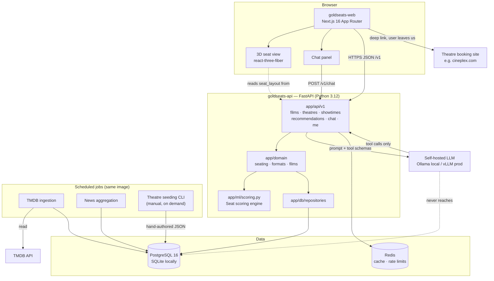
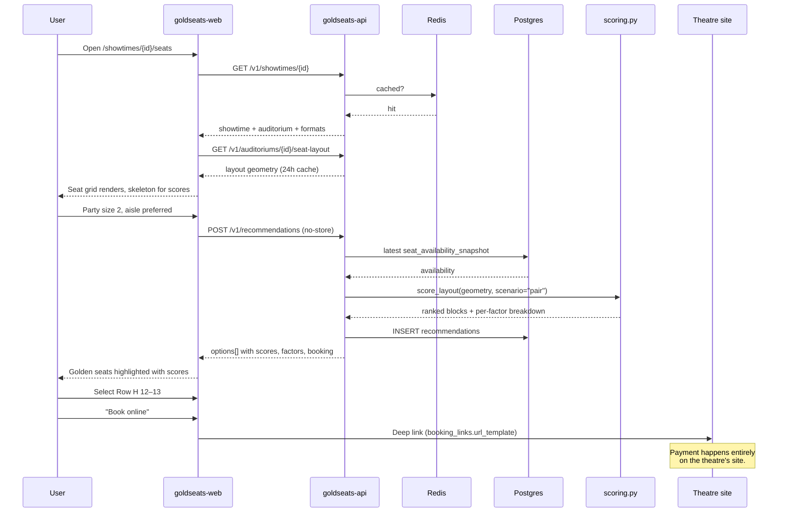

# Architecture Overview

GoldSeats is three deployables: a Next.js web app, a FastAPI service, and a set of
scheduled jobs that run inside the API's image. Everything shares one Postgres database
and one Redis instance.

It is deliberately boring. The only genuinely novel component is the seat scoring engine,
and that's a pure function.

---

## System diagram



Three properties of that picture are the important ones:

1. **The LLM has no database access.** It can only call our tools, which call our scoring
   engine and our repositories. This is what makes "the chatbot can never invent a seat" a
   structural guarantee rather than a prompt instruction. See
   [ADR-0004](adr/0004-self-hosted-llm.md).
2. **Booking leaves our system entirely.** We emit a URL; the user's browser goes to the
   theatre. No payment data ever touches us, so we're out of PCI scope entirely. See
   [`../SECURITY.md`](../SECURITY.md).
3. **Nothing scrapes.** The only inbound external data is TMDB's API and hand-authored
   theatre JSON. See [ADR-0003](adr/0003-manual-seed-theatre-data.md) and
   [`../legal/data-sources-policy.md`](../legal/data-sources-policy.md).

---

## Components

### `goldseats-web`

Next.js 16 App Router, TypeScript, Tailwind. Server components by default; client
components only where interaction demands it.

| Route | Milestone | Notes |
| --- | --- | --- |
| `/` (marketing group) | [M3](../product/milestones/M3.md) | The existing landing page, migrated, palette extracted into Tailwind tokens |
| `/` (app group) | [M3](../product/milestones/M3.md) | Now playing + upcoming, filters for title and release date, language selector |
| `/films/[filmId]` | [M4](../product/milestones/M4.md) | Aggregated timeline, nearby showtimes, "best way to experience" format ranking |
| `/showtimes/[showtimeId]/seats` | [M5](../product/milestones/M5.md) | 2D seat map with golden seats and scores; booking fork |
| 3D panel (lazy) | [M6](../product/milestones/M6.md) | react-three-fiber, dynamic import, never in the initial bundle |
| Chat panel (lazy) | [M7](../product/milestones/M7.md) | Talks only to `/v1/chat/*` |
| `/feed`, `/watchlist` | [M8](../product/milestones/M8.md) | Authenticated |

It holds no business logic. Anything that decides *which seat is better* lives in the API,
so that the web app, the chatbot, and any future native client all get the same answer.

### `goldseats-api`

```
app/
  api/v1/        HTTP surface. Thin. Validates, delegates, serialises.
  domain/        Business logic. No FastAPI imports, no session creation.
  ml/scoring.py  The seat scoring engine. Pure, synchronous, no I/O.
  ml/dataset/    The migrated synthetic dataset generator.
  db/            Models, repositories, session. All SQL lives here.
  ingest/        TMDB (M1), news (M8).
  cli/           seed_theatre.py (M2).
```

The dependency direction is one-way: `api → domain → repositories → models`, with
`domain → ml`. `domain/` and `ml/` never import from `api/`, and `ml/scoring.py` never
imports SQLAlchemy — which is precisely what lets us test it against the synthetic dataset
fixtures without a database.

### Seat scoring engine

The product. Lives at `app/ml/scoring.py`, promoted from
`goldseats-dataset/generator/recommender.py` in [M5](../product/milestones/M5.md).

Five weighted factors, each normalised to 0–1, combined into a 0–100 score:

| Factor | Weight | What it measures |
| --- | --- | --- |
| Horizontal centre | 25% | Distance from the auditorium centreline. Off-axis viewing distorts the image and the sound mix. |
| Vertical position | 25% | Depth into the auditorium. Peaks around 50% — far enough back that the screen doesn't fill your peripheral vision, close enough that it isn't a postage stamp. |
| View angle | 20% | Horizontal field of view the screen subtends, against a THX-inspired ~36° target. Penalised in both directions. |
| Neighbour openness | 15% | Whether adjacent seats are free. An empty seat beside you is worth real money. |
| Row quality | 15% | Row-level attributes: stadium elevation, recliner rows, aisle access, premium sections. |

Interface, deliberately narrow:

```python
def score_layout(
    seats: Sequence[SeatGeometry],
    *,
    scenario: PartyScenario,   # solo | pair | small_group | large_group | family
    screen_width_m: float,
) -> list[SeatScore]:
```

Properties that everything else depends on:

- **Pure and synchronous.** No database, no network, no clock. Called via
  `anyio.to_thread.run_sync` so it never stalls the event loop.
- **Group scenarios return contiguous same-row blocks only.** A returned option is always
  bookable as-is. If the party can't be seated together, it returns nothing rather than
  something misleading.
- **`SeatScore.factors` is always populated.** The chatbot's explanations and the seat map's
  hover state are both derived from the breakdown. A bare score is unusable to both.
- **Unavailable seats are still passed in**, because occupied neighbours affect the
  openness factor for the seats around them.

Weights are product decisions and live in one named constant. Changing them requires the
before/after distribution on the golden fixtures — see
[`../engineering/code-review.md`](../engineering/code-review.md).

### Data layer

| Store | Role |
| --- | --- |
| **Postgres 16** (staging, production) | Everything durable. 16 tables — see [`data-model.md`](data-model.md). |
| **SQLite** (local dev) | Same schema via Alembic, same code path. A file, no services. |
| **Redis** | Read-through cache for catalog and layouts, memoised score results, rate-limit buckets, chat session state |

The SQLite/Postgres split is a hard requirement, not a convenience: Docker is not installed
on the founder's machine, and a local setup that needs a container runtime is a local setup
that doesn't get run. The cost is a list of Postgres features we can't use, documented in
[`../engineering/database-conventions.md`](../engineering/database-conventions.md).

Redis is optional locally and required in production. A Redis outage degrades latency; it
must never cause an error.

### Jobs

Run inside the API image, scheduled by the platform.

| Job | Schedule | Writes |
| --- | --- | --- |
| TMDB ingestion | Every 6h | `films`, `film_sources`, `film_releases`, `film_timeline_events` |
| News aggregation | Hourly | `news_items`, `film_timeline_events` |
| Availability snapshot | Per request, on demand | `seat_availability_snapshots` |
| Notification dispatch | Every 15 min | Reads `follows`, sends email/push |
| Theatre seeding CLI | Manual | `theatres`, `auditoriums`, `seat_layouts`, `seats`, `showtimes`, `booking_links` |

All ingestion is idempotent and keyed on a natural key (`film_sources.source` +
`external_id`), so a re-run updates rather than duplicates.

### LLM

Same OpenAI-compatible interface both locally and in production, which is the point of the
choice: Ollama on the dev machine, vLLM behind the API in production.

Three tools, and only three:

| Tool | Backed by |
| --- | --- |
| `score_seats(showtime_id, party_size, preferences)` | `POST /v1/recommendations` |
| `lookup_showtimes(film_title?, theatre_name?, date?)` | `GET /v1/showtimes` |
| `lookup_seat_layout(auditorium_id)` | `GET /v1/auditoriums/{id}/seat-layout` |

Every seat the model mentions is verified against the tool results before the reply reaches
the user. An unverifiable reply is blocked and counted, not corrected. See
[ADR-0004](adr/0004-self-hosted-llm.md).

---

## Request flow: the core interaction

Picking seats is the request that matters, so here it is end to end.



The alternative branch — "reserve in person" — persists the pick on the `recommendations`
row and stops there. No money changes hands anywhere in our system, in either branch.

---

## Cross-cutting concerns

| Concern | Approach | Doc |
| --- | --- | --- |
| Auth | JWT bearer, 15-min access + rotating refresh. Email/password (Argon2id) + OAuth. Catalog is public. | [api-design-guidelines](../engineering/api-design-guidelines.md) |
| Config | One file per repo reads the environment. Validated at boot. | [secrets-and-config](../engineering/secrets-and-config.md) |
| Logging | `structlog` JSON, `request_id` on every line and every response | [observability](../engineering/observability.md) |
| Tracing | OpenTelemetry, spans on scoring and chat turns | [observability](../engineering/observability.md) |
| Errors | Domain exceptions → RFC 9457 problem details | [api-design-guidelines](../engineering/api-design-guidelines.md) |
| Caching | Redis server-side, Next.js `revalidate` client-side, TTLs kept in sync | [performance-budgets](../engineering/performance-budgets.md) |
| Rate limiting | Redis token bucket, per user or IP | [api-design-guidelines](../engineering/api-design-guidelines.md) |

---

## What we deliberately don't have

Listed because the absence is a decision, and someone will eventually propose each of
these:

- **No microservices.** One API service. At our scale, service boundaries would cost more
  in operational overhead than they'd buy in anything.
- **No message queue.** Scheduled jobs and synchronous requests cover every current need.
  When notification volume at [M8](../product/milestones/M8.md) justifies one, that's an
  ADR.
- **No GraphQL.** One client, well-known query shapes. `?embed=` handles the two cases that
  would have motivated it.
- **No Kubernetes.** A container on a managed platform.
- **No server-side state.** The API is stateless; sessions are JWTs and chat history is in
  Postgres. Horizontal scaling is adding instances.
- **No scraping infrastructure.** Not a capacity decision — a policy one. See
  [ADR-0003](adr/0003-manual-seed-theatre-data.md).
- **No payment processing.** Not now, not later without a very deliberate decision, because
  it would pull us into PCI scope and change the company's risk profile entirely.
- **No third-party LLM API.** See [ADR-0004](adr/0004-self-hosted-llm.md).

---

## How this gets built

| Milestone | Adds |
| --- | --- |
| [M0](../product/milestones/M0.md) | Org, three repos, protected `main`, CI, these docs |
| [M1](../product/milestones/M1.md) | FastAPI skeleton, migrations, auth, TMDB ingestion, film endpoints |
| [M2](../product/milestones/M2.md) | Versioned `seat_layout` schema, seeding CLI, 5–10 real auditoriums, showtimes, booking links |
| [M3](../product/milestones/M3.md) | Next.js shell, Tailwind tokens, home page |
| [M4](../product/milestones/M4.md) | Film detail, aggregated timeline, format ranking |
| [M5](../product/milestones/M5.md) | `app/ml/scoring.py`, `POST /v1/recommendations`, 2D seat map, booking fork |
| [M6](../product/milestones/M6.md) | react-three-fiber 3D seat view |
| [M7](../product/milestones/M7.md) | vLLM/Ollama chatbot with tool calling |
| [M8](../product/milestones/M8.md) | Follows, unified feed, notifications |
| [M9](../product/milestones/M9.md) | OpenTelemetry, Sentry, load testing, rate limiting, security review, domain cutover |

Full plan and sequencing: [`../product/roadmap.md`](../product/roadmap.md).

---

## Decision records

- [ADR-0001 — Record architecture decisions](adr/0001-record-architecture-decisions.md)
- [ADR-0002 — Stack selection](adr/0002-stack-selection.md)
- [ADR-0003 — Manually seed theatre data](adr/0003-manual-seed-theatre-data.md)
- [ADR-0004 — Self-hosted LLM](adr/0004-self-hosted-llm.md)
