# Release Process

How a merged pull request becomes running production code.

Two triggers, two destinations: **merge to `main` deploys staging automatically**; **pushing a
git tag deploys production after a manual approval.** Nothing else deploys anything.

Branching and versioning policy is in
[`../engineering/branching-and-releases.md`](../engineering/branching-and-releases.md).
Environment details are in [`environments.md`](environments.md).

---

## The pipeline

```mermaid
flowchart LR
  pr["PR opened"] --> ci["CI: lint · typecheck · test · build"]
  ci --> review["1 approval"]
  review --> squash["Squash merge to main"]
  squash --> stg["Auto-deploy staging"]
  stg --> smoke1["Smoke tests"]
  smoke1 --> verify["Manual verification"]
  verify --> tag["Push git tag"]
  tag --> ci2["Re-run full checks on the tag"]
  ci2 --> stg2["Deploy tag to staging"]
  stg2 --> gate{"Manual approval"}
  gate -->|approve| prod["Deploy production"]
  prod --> smoke2["Production smoke tests"]
  smoke2 --> rel["GitHub Release + notes"]
```



---

## Before you merge

Enforced by the branch protection ruleset on `main` in all three repos:

- CI green: `lint`, `typecheck`, `test`, `build`
- One approving review
- Branch up to date with `main`
- Conversations resolved
- Linear history — squash merge only
- No admin bypass

Plus [`../engineering/definition-of-done.md`](../engineering/definition-of-done.md), which the
PR template restates.

**Check the squash commit message before confirming.** GitHub likes to paste the entire commit
list into the body; trim it to the PR description. That message becomes the changelog entry and
the thing you'll read while debugging in six months.

---

## Staging deploy

Automatic, on every merge to `main`. No gate.

1. Build the container image / static bundle, tagged with the commit SHA
2. Run `alembic upgrade head` against the staging database
3. Deploy
4. Wait for `GET /health/ready` to report ready
5. Run smoke tests
6. Notify on failure

If staging breaks, `main` is broken. Fix `main` — either revert or roll forward. Don't leave
staging red, because a red staging environment means nobody can verify anything and the next
person merges blind.

### Smoke tests

Fast, shallow, and they hit the things that break:

```bash
curl -fsS "$API/health/ready" | jq -e '.status == "ready"'
curl -fsS "$API/v1/films/now-playing?limit=1" | jq -e '.data | length > 0'
curl -fsS "$API/v1/theatres?limit=1"          | jq -e '.data | length > 0'
curl -fsS -X POST "$API/v1/recommendations" \
  -H 'content-type: application/json' \
  -d "{\"showtime_id\":\"$SMOKE_SHOWTIME_ID\",\"party_size\":2}" | jq -e '.options | length > 0'
curl -fsS "$WEB/" | grep -q 'GoldSeats'
```

That last recommendation check is the one that matters most — it exercises the database, the
layout projection, the availability snapshot, and the scoring engine in one request. If it
passes, most of the product works.

---

## Verify on staging

Before tagging a production release, actually look at it. CI going green is not verification.

- Exercise the flows your changes touched.
- Walk the core path end to end: home → filter → film → showtime → recommendation → booking
  handoff.
- Check the dashboards for anything new: error rate, latency, empty-recommendation rate.
- Read the logs for new warnings or errors.
- For UI changes: look at it on a phone. A real one.

---

## Production release

### 1. Confirm `main` is green and staging is healthy

```bash
gh run list --branch main --limit 1
curl -fsS https://api-staging.goldseats.app/health/ready
```

### 2. See what's going out

```bash
git log --oneline $(git describe --tags --abbrev=0)..HEAD
```

Read it. If anything in that list surprises you, stop and find out why before tagging.

### 3. Update the changelog

Generated from Conventional Commits, then edited by a human so it's readable. Format and
examples in
[`../engineering/branching-and-releases.md`](../engineering/branching-and-releases.md#changelogs).

### 4. Tag

```bash
git tag -a v0.5.0 -m "release: v0.5.0 — film catalog filters, TMDB backfill"
git push origin v0.5.0
```

Bump per the table in
[`../engineering/branching-and-releases.md`](../engineering/branching-and-releases.md#versioning):
any `feat:` in the range is a minor bump, otherwise patch.

**Tags are immutable.** Never move or delete one. A bad tag is fixed by cutting the next patch
version.

### 5. The workflow takes over

1. Re-runs the full check suite against the tagged commit
2. Builds and publishes the image, tagged with the version
3. Deploys to staging and runs smoke tests
4. **Waits for manual approval**
5. Deploys production: migrations, then the new version
6. Runs production smoke tests
7. Creates the GitHub Release with generated notes

### 6. Approve, then watch

Before approving, ask: is anyone around to notice if this goes wrong? If not, wait.

After approving, watch for 15 minutes:

- Error rate on the service health dashboard
- p95 latency on `/v1/films/now-playing` and `/v1/recommendations`
- Sentry for new issues tagged with this release
- `booking_handoff_total` still moving — a silent drop to zero is the failure that no error rate
  will show you

---

## Migrations during a deploy

**Both versions of the code run simultaneously during a deploy.** Old instances are still
serving while new ones start. So every migration must be compatible with the code that's
already deployed.

Rules, in full in
[`../engineering/database-conventions.md`](../engineering/database-conventions.md):

- Expand in one release, contract in a later one
- Never rename or drop a column that deployed code still reads
- Never add a `NOT NULL` column without a default in a single step
- Every migration has a tested `downgrade()`

Practically, this is what makes rollback safe: redeploying the previous tag works because the
schema is still a superset of what that code needs.

---

## Rollback

**Default to rolling back, not forward.** A revert takes two minutes and is understood; a fix
written under pressure at 11pm is a second incident.

```bash
# API
gh workflow run deploy.yml -f version=v0.4.1 -f environment=production
```

Web: use the host's instant rollback to the previous deploy.

Full procedure, including the migration question:
[`runbooks/api-rollback.md`](runbooks/api-rollback.md).

Then: open an issue, write the post-incident note within 48 hours, and only then work on the
forward fix.

---

## Hotfixes

A production-breaking bug is still a normal `fix/` branch. What changes is urgency, not process:

1. Declare the incident if users are affected —
   [`incident-response.md`](incident-response.md)
2. **Consider rolling back first.** Usually the right answer.
3. If rolling forward: minimal diff, CI green, expedited review — a reviewer drops what they're
   doing
4. Squash merge, tag a patch release immediately
5. Post-incident note within 48 hours

We never patch an old tag. There's no maintenance line; production runs the tip of `main`'s
latest tag and fixes go forward.

---

## Cadence

| Environment | Cadence | Gate |
| --- | --- | --- |
| Preview (web PRs) | Every push | CI green |
| Staging | Every merge to `main` | CI green |
| Production | On demand, 1–3 per week | Manual approval + green staging |

**No production releases on a Friday afternoon** unless they're fixing something already
broken. Not superstition — it's about who's around to read the graphs.

---

## Release checklist

Copy this into the release PR or issue:

```markdown
## Pre-release
- [ ] `main` green
- [ ] Staging healthy, smoke tests passing
- [ ] Changes manually verified on staging
- [ ] `git log` since last tag reviewed; nothing unexpected
- [ ] CHANGELOG.md updated and readable
- [ ] Migrations reviewed for backwards compatibility
- [ ] Rollback plan understood for this specific release
- [ ] Someone is available to watch it

## Release
- [ ] Version bumped per Conventional Commits
- [ ] Tag pushed
- [ ] Workflow green through the staging stage
- [ ] Manual approval given
- [ ] Production deploy succeeded
- [ ] Production smoke tests passed

## Post-release
- [ ] 15 minutes of dashboard and Sentry watching, clean
- [ ] `booking_handoff_total` still moving
- [ ] GitHub Release published with readable notes
- [ ] Issues in the release closed
- [ ] Anything unexpected written down
```

---

## What we deliberately don't do

- **No release branches.** Tags from `main`.
- **No manual deploys.** If you're running a deploy command by hand outside the workflow,
  something is wrong with the workflow.
- **No skipping staging.** There is no path from a laptop to production.
- **No deploying from a laptop.** CI has the credentials; humans don't need them.
- **No blue/green or canary yet.** Traffic is low enough that instant rollback is a better
  investment than traffic splitting. Revisit when volume justifies it.
