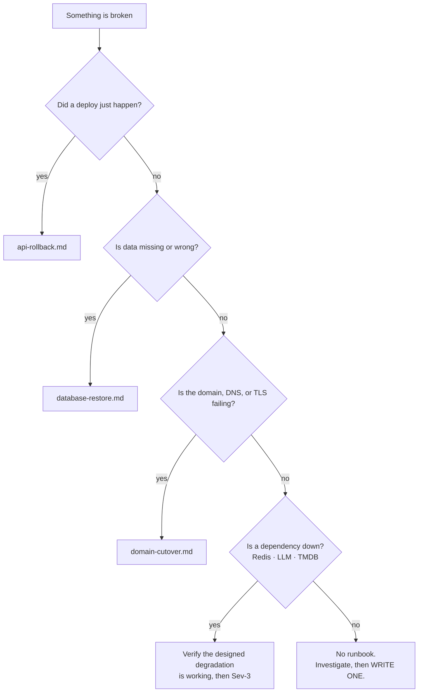

# Runbooks

Step-by-step procedures for things that go wrong. Written to be followed at 3am by a tired
person, which means: no reasoning required, commands you can copy, and the decision points
called out explicitly.

---

## Index

| Runbook | Use when |
| --- | --- |
| [`api-rollback.md`](api-rollback.md) | A deploy broke production. Error rate up, latency up, or a core flow failing after a release. |
| [`database-restore.md`](database-restore.md) | Data loss, corruption, a bad data migration, or a database that won't start. |
| [`domain-cutover.md`](domain-cutover.md) | Moving `goldseats.app` to a new host, DNS problems, TLS problems. Also covers the lost Netlify account. |

Start with [`../incident-response.md`](../incident-response.md) if you haven't declared the
incident yet. Declaring takes thirty seconds and makes everything after it easier.

---

## Which runbook



**"Did a deploy just happen?"** is the first question for a reason. It's the answer more often
than everything else combined.

```bash
curl -s https://api.goldseats.app/health/ready | jq .version
gh run list --repo goldseats/goldseats-api --workflow deploy.yml --limit 3
```

---

## Designed degradations

Several failures have a built-in fallback. Before escalating, confirm the fallback is actually
working — often the correct response is "verify and go back to bed".

| Dependency down | Expected behaviour | Severity if behaving |
| --- | --- | --- |
| **Redis** | Cache misses fall through to the database. Slower, not broken. Rate limiting disabled. | Sev-3 |
| **vLLM / LLM** | Chat returns a plain unavailable message; the deterministic seat map still works. | Sev-3 |
| **TMDB** | Ingestion fails; existing catalog data is served. Goes stale over days. | Sev-3 |
| **A theatre's booking site** | Deep links fail on their end. We can't fix it; the recommendation still works. | Sev-4 |
| **Email provider** | Notifications queue. Signup verification blocked — that one is Sev-2. | Sev-2/3 |

**If a fallback isn't working, that's the incident**, and it's more serious than the original
failure — because a broken fallback means every future outage is worse than we designed for.

---

## Runbook standards

Every runbook in this directory has:

1. **When to use this** — the symptom, not the cause
2. **Prerequisites** — access and tools needed, verifiable before you start
3. **Numbered steps** with copy-pasteable commands
4. **Decision points** called out, with the criteria for each branch
5. **Verification** — how you know it worked
6. **Rollback of the runbook itself** — what to do if the procedure makes things worse
7. **Escalation** — when to stop and get help
8. **Last drilled** — a date, because an undrilled runbook is a guess

---

## Writing a new one

Write it during or immediately after the incident, while you still remember the details that
matter. A runbook written a week later is missing the thing that actually cost you twenty
minutes.

Rules:

- **No prose paragraphs in the steps.** Numbered, imperative, one action each.
- **Real commands with real hostnames.** `psql $PRODUCTION_DATABASE_URL`, not `<your db here>`.
- **State the prerequisite explicitly.** "You need DNS registrar access" belongs at the top, not
  discovered at step 7.
- **Say what "worked" looks like**, with a command that proves it.
- **Include the dangerous step's guard.** If a command is destructive, the runbook says so and
  says what to snapshot first.
- **Date the drill.** Undrilled runbooks are wrong in small ways that only show up under
  pressure.

---

## Drills

Quarterly, in staging. The first full round is a [M9](../../product/milestones/M9.md)
deliverable.

| Drill | Cadence | Record |
| --- | --- | --- |
| API rollback | Quarterly | Time from decision to healthy |
| Database restore | Quarterly | Real RTO and RPO |
| Alert firing | Quarterly | Every alert routes correctly |
| Runbook read-through | Quarterly | Fix whatever's stale |

Drilling is how a runbook stops being a document and becomes a capability. Every drill finds
something: an expired credential, a renamed flag, a command that no longer exists. Finding those
in a drill is free; finding them during a Sev-1 is not.

---

## Runbooks we still need

Tracked here so the gaps are visible:

- [ ] **Redis failure** — verify degradation, flush a poisoned cache. After
      [M5](../../product/milestones/M5.md).
- [ ] **vLLM failure and GPU OOM** — restart, reload the model, verify degradation. New
      operational surface from [M7](../../product/milestones/M7.md).
- [ ] **Stale theatre data** — a seeded layout no longer matches reality. Re-seed and bump the
      layout version.
- [ ] **Booking links broken en masse** — a chain changed its URL structure. Detection and
      re-seeding.
- [ ] **Leaked secret** — the procedure is in
      [`../../engineering/secrets-and-config.md`](../../engineering/secrets-and-config.md);
      promote it to a runbook.
- [ ] **Certificate expiry** — should be automatic, but the manual path needs writing down.

---

## Related

- [`../incident-response.md`](../incident-response.md) — severities, roles, comms
- [`../on-call.md`](../on-call.md) — who responds, access checklist
- [`../environments.md`](../environments.md) — what runs where
- [`../release-process.md`](../release-process.md) — how deploys work
- [`../../engineering/observability.md`](../../engineering/observability.md) — dashboards and
  alerts
