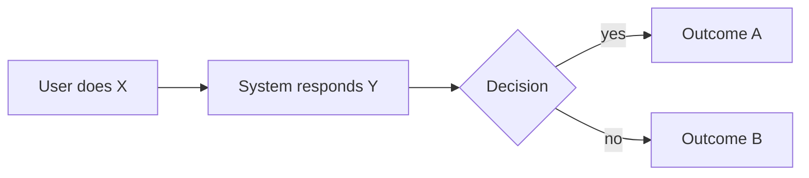

# PRD — <Feature name>

- **Status:** Draft | In review | Accepted | Shipped | Cancelled
- **Author:** name
- **Date:** 2026-MM-DD
- **Milestone:** the milestone this belongs to, linked — e.g. [M5](../milestones/M5.md)
- **Related:** ADRs, RFCs, issues

---

## Problem

What's wrong or missing today, from the user's point of view. No solution here.

Anchor it in a concrete moment. "Someone standing outside a Cineplex at 7:15pm deciding
whether to buy for the 7:30 showing, on a phone, on transit data" is a design constraint you
can actually build against. "Users want better seats" is not.

If you can't describe the problem without describing your solution, stop and think harder.

## Who this is for

The specific person. If there's more than one, say which one wins when they conflict.

- **Primary:** e.g. a solo moviegoer who cares about picture and sound quality and will pay
  for a premium format
- **Secondary:** e.g. a group of four who care more about sitting together than about the
  perfect centre seat
- **Explicitly not:** who this feature isn't for

## Why now

Why this milestone and not a later one. What it unblocks, or what's broken without it.

## Success metrics

How we'll know it worked. Agreed **before** building, measurable **after** shipping.

| Metric | Current | Target | How measured |
| --- | --- | --- | --- |
| e.g. Sessions reaching a seat map that produce a booking handoff | unknown | 60% | `booking_handoff_total` / seat map views, [observability](../../engineering/observability.md) |

Include a **counter-metric** — the thing that must not get worse. A feature that raises
handoffs while raising p95 latency past budget hasn't succeeded.

## Requirements

Numbered, testable, prioritised. Each one becomes acceptance criteria on an issue.

### Must have

1. …
2. …

### Should have

3. …

### Could have

4. …

## Not doing

The most important section. Be specific, and say why — "out of scope" without a reason
reopens the argument next week.

- …
- …

Check against the permanent boundaries in [`../roadmap.md`](../roadmap.md): no payment
processing, no scraping, no held seats, no coverage outside Canada yet. A requirement needing
one of those needs an ADR first, not a PRD.

## User flow

Walk through it. Mermaid, a numbered list, or a sketch — whatever's clearest.

## Edge cases and failure states

The part that separates a specification from a wish. For GoldSeats, at minimum:

- What if no seats are available at all?
- What if the party can't be seated contiguously?
- What if availability is `simulated` with `confidence='low'`? **How do we say so?**
- What if the theatre isn't seeded?
- What if the user needs accessible seating and none is available?
- What if the API is slow, or down?
- What does a first-time user with no data see?
- What does this look like on a 375px screen?

## Data

What we read, what we write, and whether the schema changes.

- Tables read: …
- Tables written: …
- New columns or tables: if yes, this needs a
  [`../../architecture/data-model.md`](../../architecture/data-model.md) update and an
  expand/contract plan
- New personal data collected: if yes, this needs a
  [`../../legal/privacy-policy.md`](../../legal/privacy-policy.md) update
- New external data source: if yes, this needs a
  [`../../legal/data-sources-policy.md`](../../legal/data-sources-policy.md) check and
  probably an ADR

## Accessibility

Not a checkbox. What specifically needs thought here?

- Keyboard model for any new interaction
- What information is currently conveyed by colour, and what the second signal is
- What a screen reader hears at each step
- See [`../../engineering/accessibility.md`](../../engineering/accessibility.md)

## Performance

Which budgets in
[`../../engineering/performance-budgets.md`](../../engineering/performance-budgets.md) this
touches, and the plan to stay inside them.

## Copy

Exact user-facing strings for anything where wording carries risk. Precision matters most
where we could mislead:

- "Reserve in person" must never imply the seat is held
- Simulated availability must be disclosed plainly, not hedged into meaninglessness
- Error messages are written for the user, not the developer

## Open questions

What we don't know yet, and who decides. An accepted PRD should have none left, or should
name the person and the date.

## Rollout

- Feature flag name and default
- Staging validation plan
- Whether this ships to everyone at once
- What "off" looks like if we need to disable it

## Appendix

Research, competitor notes, screenshots, links.
