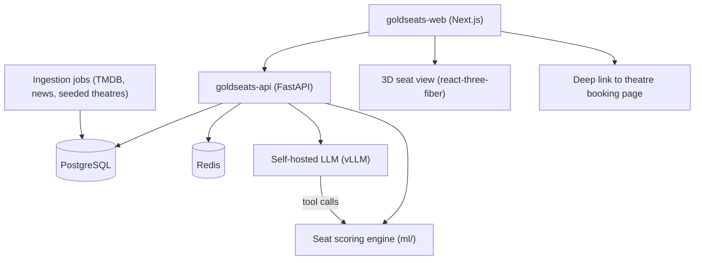

# GoldSeats — Project Context Handoff

This file is a complete handoff for continuing work in a new chat session.
Read this file top to bottom before making any changes.

---

## 1. What GoldSeats Is

GoldSeats is an AI-powered movie-theatre seat recommendation product.
Domain: `goldseats.app`. Primary market assumed to be Canada (Cineplex).

Core product ideas:

- Analyze a theatre's seating layout and recommend the best available seat(s)
  for a solo viewer or a group, using an AI scoring model.
- A chatbot that does seat selection conversationally, grounded in real data.
- A 3D "view from this seat" preview showing the screen from the chosen seat.
- Hand the user off directly to the theatre's booking/payment page.
- Let the user choose between buying online or reserving to pay in person.
- Follow/track films and aggregate film news from many sources into one feed.
- A main page with currently playing and upcoming films, with filters for
  name and release date plus a language selector.
- A film detail page showing everything about a film from all sources as an
  expandable timeline, where it is currently playing nearby, the best format
  to experience it in, the best seats, and the view from those seats.

---

## 2. Current State On Disk

Workspace root: `/Users/barung/Startup/goldseats`

The old nested `goldseats/goldseats/` folder was flattened into the workspace
root, and the legacy `.git` directory (remote `barung1/goldseats`) went with
it. No committed work was lost — everything that mattered was untracked and is
still on disk. The legacy repo still exists on GitHub and should be archived.

Current layout:

```
/Users/barung/Startup/goldseats
├── goldseats-api/   → github.com/Irukkai/goldseats-api
├── goldseats-web/   → github.com/Irukkai/goldseats-web
└── goldseats-docs/  → github.com/Irukkai/goldseats-docs
```

The root `index.html` and `goldseats-dataset/` were deleted after their copies
inside the repos were verified byte-identical.

Legacy content, both now migrated:

- `index.html` — a finished single-file marketing landing page (876 lines).
  Dark cinema theme, near-black `#0a0a0f` background, gold `#FFD700` accents,
  Inter + Playfair Display via Google Fonts, Font Awesome social icons,
  sticky navbar, hero with animated seat-grid background and a "Golden Seat
  Score: 98/100" pulse pill, social proof bar, How It Works (3 cards),
  Why GoldSeats (6 feature cards), Formspree waitlist form with the action
  left as `https://formspree.io/f/YOUR_FORM_ID`, an in-page Privacy Policy
  section, and a footer. This page is currently deployed via Netlify.

- `goldseats-dataset/` — a working synthetic seat-map dataset generator in
  Python, used to train the seat-recommendation CV model. Structure:
  - `config.py` — theatre/booking/scenario distributions, occupancy ranges,
    scoring weights, render constants, seat colors.
  - `generate.py` — CLI with `--count`, `--output`, `--preview`, `--seed`.
    Writes PNG images, per-image JSON labels, `dataset.csv`, `config_used.json`.
  - `visualize.py` — random sample previewer using matplotlib.
  - `generator/theatre.py` — 5 theatre types: standard, large, small, imax,
    recliners. Handles rows, seats per row, aisles, row curvature, stadium
    elevation, and the IMAX premium centre section.
  - `generator/seats.py` — seat types (regular, recliner, wheelchair,
    companion) plus a realistic booking simulator (centre-first, back rows
    before middle, aisle preference, front-row penalty, 1-4 seat group
    chunks, clustering into natural islands).
  - `generator/recommender.py` — the ground-truth scorer. Weighted factors:
    horizontal centre 25%, vertical position 25% (peaks ~50% depth),
    view angle 20% (THX-inspired ~36 degree target), neighbour openness 15%,
    row quality 15%. Scenario resolution for solo / pair / small_group /
    large_group / family, with contiguous same-row blocks guaranteed.
  - `generator/renderer.py` — Pillow renderer, 800x600 PNG, glowing screen,
    rounded seats, gold halo on recommended seats, row labels, seat numbers,
    bottom legend.
  - `output/` — a 10-image preview run already exists there.
  - `requirements.txt` — Pillow 10.2.0, numpy 1.26.0, pandas 2.1.0,
    tqdm 4.66.0, matplotlib 3.8.0.

Netlify note: DNS has `CNAME www.goldseats.app -> stellar-hotteok-63503a.netlify.app`
but the owning Netlify account was lost. Plan is to redeploy to a known
account during M9 cutover.

---

## 3. Local Environment Facts

- Node v20.19.0, npm 10.8.2 — installed and working.
- Python 3.12.4 at `/usr/local/bin/python3` — installed and working.
- `gh` CLI v2.100.0 installed but the token for account `barung81` is INVALID.
  Must run `gh auth login --hostname github.com --git-protocol https --web`
  followed by `gh auth setup-git` before any push will work.
- Docker is NOT installed. Therefore the backend must run on a local SQLite
  file by default and switch to Postgres via a `DATABASE_URL` env var.
  Optional later: `brew install --cask docker`.
- Installed during M0 scaffolding: `goldseats-api/.venv` (gitignored) with the
  dev requirements, and `goldseats-web/node_modules`.
- Port 3000 is occupied by an unrelated Next.js project, so `npm run dev` in
  `goldseats-web` falls back to port 3001.

---

## 4. Decisions Already Locked (do not re-ask)

- GitHub Organization to be created by the user, containing three repos:
  `goldseats-web`, `goldseats-api`, `goldseats-docs`.
- Repos are PUBLIC (so branch protection and CI are free). No secrets in git;
  only `.env.example` files are committed.
- Frontend: Next.js 15 (App Router) + TypeScript + Tailwind.
- Backend: Python FastAPI + SQLAlchemy + Alembic, Postgres in production,
  SQLite for local development.
- Theatre data strategy: manually seed a small set of real theatre layouts
  and showtimes first. No scraping. Expand sources later.
- Chatbot: self-hosted open model (Ollama for local dev, vLLM for production)
  with tool-calling into our own seat-scoring engine so it can never invent
  seats.
- Booking is a deep-link handoff to the theatre's own site. We do not process
  payments ourselves, so no PCI scope.
- Folder layout: ideally the three repos live as siblings at
  `/Users/barung/Startup/goldseats/`. They may initially be created inside
  `/Users/barung/Startup/goldseats/goldseats/` and moved later with a single
  `mv` — this does not affect git remotes or history.

---

## 5. Migration Of Existing Work

- `index.html` becomes the marketing route inside `goldseats-web`, with its
  gold/dark palette extracted into Tailwind design tokens.
- `goldseats-dataset/` moves into `goldseats-api` under `ml/dataset/`, and
  `generator/recommender.py` is promoted into the production scoring service
  at `app/ml/scoring.py`.
- The legacy `barung1/goldseats` repo gets archived once the split is done.

---

## 6. Architecture



Core data model to build across M1 and M2:

- `films`, `film_sources`, `film_releases`, `film_timeline_events`
- `theatres`, `auditoriums`, `seat_layouts`, `seats`
- `showtimes`, `showtime_formats`, `seat_availability_snapshots`
- `recommendations`, `users`, `follows`, `news_items`, `booking_links`

---

## 7. The Milestone Plan (M0 to M9)

Each milestone is self-contained and shippable, and maps to a GitHub
Milestone so work stays scoped to one target at a time.

### M0 — Foundation and Governance

Create the org, three repos, branch protection rulesets, and the full docs set.

`goldseats-docs` contents:

- Root: `README.md`, `CONTRIBUTING.md`, `CODE_OF_CONDUCT.md`, `SECURITY.md`, `LICENSE`
- `engineering/`: `code-conventions-typescript.md`, `code-conventions-python.md`,
  `git-workflow.md`, `branching-and-releases.md`, `code-review.md`,
  `testing-strategy.md`, `definition-of-done.md`, `api-design-guidelines.md`,
  `database-conventions.md`, `observability.md`, `secrets-and-config.md`,
  `accessibility.md`, `performance-budgets.md`
- `architecture/`: `overview.md`, `data-model.md`, `adr/template.md`,
  `adr/0001-record-architecture-decisions.md`, `adr/0002-stack-selection.md`,
  `adr/0003-manual-seed-theatre-data.md`, `adr/0004-self-hosted-llm.md`
- `product/`: `roadmap.md`, `glossary.md`, `milestones/M0.md` .. `milestones/M9.md`, `prd/`
- `operations/`: `environments.md`, `release-process.md`, `incident-response.md`,
  `on-call.md`, `runbooks/`
- `onboarding/`: `day-one.md`, `local-setup.md`, `tooling.md`
- `legal/`: `data-sources-policy.md`, `privacy-policy.md`, `terms.md`
- `templates/`: `rfc-template.md`, plus an org-level `.github` repo holding the
  shared PR template, issue forms, and `CODEOWNERS`

Git workflow standard: trunk-based development off `main`, short-lived
`feat/`, `fix/`, `chore/` branches, Conventional Commits, squash merge,
required CI plus one approval.

Done when: both code repos have a green CI skeleton (lint, typecheck, test,
build) and a protected `main`.

### M1 — Backend Core and Film Catalog

FastAPI skeleton with `app/api`, `app/domain`, `app/db`, Alembic migrations,
structured logging, health checks, OpenAPI. Auth with email plus OAuth and JWT
sessions. TMDB ingestion job populating `films`, `film_releases`, and language
metadata. Endpoints for now-playing, upcoming, and film-by-id.

Done when: `/films/now-playing` and `/films/upcoming` return real data with
filters for title, release date, and language.

### M2 — Theatre Seeding Pipeline

Versioned `seat_layout` JSON schema, an admin seeding CLI, and 5 to 10
hand-seeded real auditoriums. Reuse the geometry logic from
`generator/theatre.py` so seeded layouts match what the model was trained on.
Model showtimes and `booking_links` per showtime.

Done when: a seeded theatre renders a correct seat grid via API and each
showtime carries a valid outbound booking URL.

### M3 — Web Shell and Home Page

Next.js App Router project, Tailwind config carrying the gold/dark tokens from
the landing page, shared UI kit, marketing page migrated in. Home page lists
currently playing and upcoming films with filters for name and release date
plus a language selector. Server components with caching, skeleton loading,
full mobile responsiveness.

Done when: home page is live against the real API with working filters and
Lighthouse scores above 90.

### M4 — Film Detail and Timeline

Film detail route with an expandable aggregated timeline built from
`film_timeline_events` (announcement, trailer, festival, release, reviews,
news). Shows where the film is currently playing nearby plus a "best way to
experience" panel ranking available formats such as IMAX, Dolby, standard.

Done when: a film page shows a multi-source timeline plus nearby showtimes
grouped by format.

### M5 — Seat Intelligence and Booking Handoff

Promote the recommender into `app/ml/scoring.py` as a documented service.
Expose `POST /recommendations` taking a showtime, party size, and preferences.
Interactive 2D seat map in the web app highlighting golden seats with scores.
Flow ends with a choice between booking online (deep-link to the theatre) and
reserving in person (saves the pick for later).

Done when: a user can pick a showtime, receive ranked seats with scores, and
land on the theatre's booking page for those seats.

### M6 — 3D View From Seat

react-three-fiber auditorium scene generated from the same `seat_layout` data.
Camera placed at the selected seat's eye position, screen rendered at true
relative size so the viewing angle is honest. Quality fallback for low-end
devices.

Done when: selecting any seat renders its 3D view at 60fps on desktop and
degrades gracefully on mobile.

### M7 — Self-Hosted Seat Chatbot

Ollama for local development and vLLM behind the API in production, serving a
Llama or Mistral instruct model. Tool-calling into the scoring endpoint,
showtime lookup, and layout lookup so the model never invents seats. Prompt
templates, guardrails, conversation persistence, and evaluation fixtures built
from the synthetic dataset.

Done when: a user can say "two seats, not too close, aisle preferred" and get
a grounded, verifiable recommendation.

### M8 — Follow, Track, and Unified News

Follow films, theatres, and people. Aggregate news and release updates into
one feed per user. Watchlist and "seen" tracking with optional import from
external services. Email and web push notifications for release dates and
local showtime availability.

Done when: a logged-in user has a personalized feed and receives a release
notification.

### M9 — Hardening and Launch

Observability with OpenTelemetry and Sentry, dashboards, load testing, rate
limiting, caching strategy, security review, privacy and terms finalized,
staging and production environments, backup and restore drill, and the domain
cut over to the new web app.

Done when: production runs on `goldseats.app` with monitoring, alerting, and a
documented rollback path.

### Sequencing Notes

- M0 through M2 are backend and governance heavy and unblock everything else.
- M3 and M4 can run in parallel with M2 once the API contract is frozen.
- M6 and M7 both depend on M5 shipping the scoring contract.

---

## 8. Setup Runbook For The User

1. Create the GitHub org at https://github.com/organizations/plan (Free plan).
2. Create three PUBLIC and EMPTY repos in the org: `goldseats-web`,
   `goldseats-api`, `goldseats-docs`. Do not add a README, .gitignore, or
   license, so the first push is clean.
3. Re-authenticate the CLI:
   ```
   gh auth login --hostname github.com --git-protocol https --web
   gh auth setup-git
   gh auth status
   ```
4. First push, repeated per repo, replacing `<ORG>`:
   ```
   cd goldseats-api
   git init -b main
   git add .
   git commit -m "chore: initial commit"
   git remote add origin https://github.com/<ORG>/goldseats-api.git
   git push -u origin main
   ```
5. Day-to-day flow:
   ```
   git checkout -b feat/film-catalog
   git add .
   git commit -m "feat(films): add now-playing endpoint"
   git push -u origin feat/film-catalog
   gh pr create --fill
   ```
6. Local run commands once scaffolded:
   ```
   # Backend — http://localhost:8000, docs at /docs
   cd goldseats-api
   python3 -m venv .venv && source .venv/bin/activate
   pip install -r requirements.txt
   alembic upgrade head
   uvicorn app.main:app --reload

   # Frontend — http://localhost:3000
   cd goldseats-web
   npm install
   npm run dev
   ```

---

## 9. What M0 Delivered

All three repos exist as sibling folders under `/Users/barung/Startup/goldseats`
and are pushed to the `Irukkai` org. See section 10 for the current status.

### `goldseats-api` — done and green

FastAPI app factory with structured logging (structlog), per-request IDs, and
CORS. Settings default to a local SQLite file and switch to Postgres through
`DATABASE_URL` alone. SQLAlchemy declarative base with explicit constraint
naming and a `TimestampMixin`; Alembic reads the same settings as the app and
uses batch mode under SQLite. `/api/v1/health` and `/api/v1/ready` are live,
also served unprefixed for platform probes. The dataset generator was copied
to `ml/dataset/` with its `output/` run and `__pycache__` stripped.

Verified locally: `ruff check` clean, `ruff format --check` clean, `mypy app`
clean under strict mode across 17 files, 6 pytest tests passing, and
`alembic upgrade head` succeeding against a fresh SQLite file.

### `goldseats-web` — done and green

Next.js 15.5.25 App Router, React 19, TypeScript, Tailwind v4. The gold/dark
palette is extracted into Tailwind `@theme` tokens in `src/app/globals.css`
(`ink`, `ink-elevated`, `ink-card`, `cream`, `cream-muted`, `gold`,
`gold-soft`, `gold-deep`, `shadow-card`, `rounded-card`, `font-display`).
Inter and Playfair Display load through `next/font`. `src/lib/api.ts` is the
typed API client, `src/lib/env.ts` the only place `process.env` is read. The
shell home page reports whether the API is reachable. A gold seat mark lives
at `src/app/icon.svg`; the default Vercel assets were deleted. The original
landing page is preserved verbatim at `reference/legacy-landing.html` for the
M3 conversion and is excluded from lint and format.

Verified locally: ESLint clean, Prettier clean, `tsc --noEmit` clean, 11
Vitest tests passing, `next build` succeeding.

Two config quirks worth remembering, both already handled in
`vitest.config.mts`: Vitest cannot load the Tailwind v4 PostCSS plugin, so
PostCSS is disabled for tests; and because `tsconfig.json` sets
`jsx: "preserve"` for the Next compiler, Vitest needs `esbuild.jsx` set to
`"automatic"` explicitly.

### `goldseats-docs` — written

The full content set described in section 7 under M0.

### End-to-end check

With the API on `:8000` and the web app running, the home page renders
"API reachable · local · v0.1.0", so the two halves talk to each other.
Note that port 3000 was occupied by an unrelated Next.js project, so the dev
server fell back to 3001.

### Both repos also carry

A PR template with a Conventional Commits and milestone checklist, a
`dependabot.yml` grouping weekly minor and patch updates, and a CI workflow
with four separate jobs — lint, typecheck, test, build — so a red check names
the actual failure.

---

## 10. M0 Shipped

The GitHub organization is **`Irukkai`** (Tamil for "seat"). All three repos
are public and live:

- https://github.com/Irukkai/goldseats-api
- https://github.com/Irukkai/goldseats-web
- https://github.com/Irukkai/goldseats-docs

CI is green on `main` in both code repos — all four jobs, on GitHub, not just
locally. Milestones M0 through M9 exist in all three repos with their
"done when" criteria as descriptions.

Every repo has an active `protect-main` ruleset on the default branch:
squash-merge only, linear history, no force pushes, no deletion, a pull
request with one approving review, resolved review threads, and — in the two
code repos — all four CI jobs required and required to be up to date with
`main`. Approvals come from a second account the founder controls.

One CI failure had to be fixed after the first push. `vitest@2` bundles Vite 5
(esbuild 0.21) while `@vitejs/plugin-react@6` needs Vite 7 (esbuild 0.28), so
the two halves of the test toolchain disagreed on a single hoisted esbuild and
`npm ci` refused the lockfile. Local `npm install` had papered over it. Moving
to `vitest@3` resolved it. The lesson: verify with `rm -rf node_modules &&
npm ci`, not `npm install`.

### Known follow-ups, not blockers

- `npm audit` reports two advisories in `goldseats-web`, both needing a major
  bump: a moderate path-traversal in `@vitest/mocker` (fixed in vitest 4) and
  a high-severity PostCSS issue reachable only through Next's build tooling
  (fixed in Next 16). Next 16 is current; the ADR selecting Next 15 predates
  it and should be revisited.
- The Formspree form in the legacy landing page still has the placeholder
  action `https://formspree.io/f/YOUR_FORM_ID`. Fix during the M3 migration.
- The legacy `barung1/goldseats` repo is still active and should be archived.

## 11. Prompt To Start The Next Chat

> Read `product/project-handoff.md` in `goldseats-docs` for full project
> context, then continue implementing the GoldSeats platform plan. M0 is
> complete; begin M1, backend core and film catalog.
