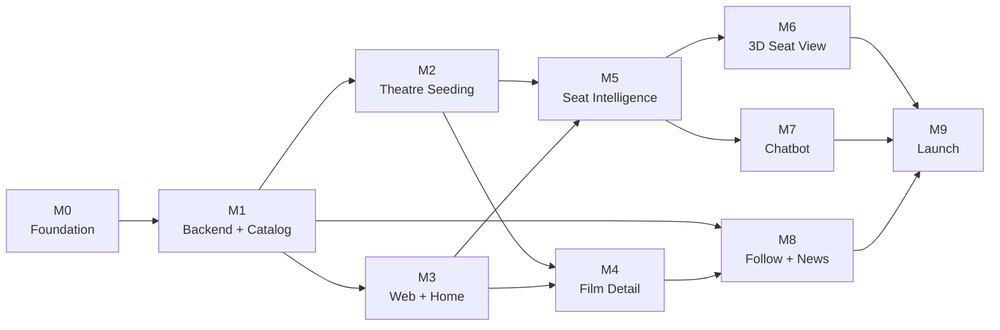

# Roadmap

Ten milestones, M0 through M9, from an empty GitHub org to a monitored production app on
`goldseats.app`. Each one is self-contained, shippable, and maps to a GitHub Milestone so
work stays scoped to a single target.

Each milestone has a **done-when criterion** — a single observable fact, demonstrable to
another person. Not "the endpoint is implemented" but "`/films/now-playing` returns real data
with working filters". The criterion is the milestone's definition; everything else is
supporting detail.

---

## At a glance

| # | Milestone | Ships | Done when |
| --- | --- | --- | --- |
| [M0](milestones/M0.md) | Foundation and Governance | Org, three repos, protected `main`, CI, full docs | Both code repos have green CI and a protected `main` |
| [M1](milestones/M1.md) | Backend Core and Film Catalog | FastAPI skeleton, migrations, auth, TMDB ingestion, film endpoints | `/films/now-playing` and `/films/upcoming` return real data with title, date, and language filters |
| [M2](milestones/M2.md) | Theatre Seeding Pipeline | `seat_layout` schema, seeding CLI, 5–10 real auditoriums, showtimes, booking links | A seeded theatre renders a correct seat grid via API and every showtime has a valid booking URL |
| [M3](milestones/M3.md) | Web Shell and Home Page | Next.js project, Tailwind tokens, migrated marketing page, home page | Home page is live against the real API with working filters and Lighthouse above 90 |
| [M4](milestones/M4.md) | Film Detail and Timeline | Film detail route, aggregated timeline, format ranking | A film page shows a multi-source timeline plus nearby showtimes grouped by format |
| [M5](milestones/M5.md) | Seat Intelligence and Booking Handoff | `app/ml/scoring.py`, `POST /recommendations`, 2D seat map, booking fork | A user picks a showtime, gets ranked seats with scores, and lands on the theatre's booking page |
| [M6](milestones/M6.md) | 3D View From Seat | react-three-fiber auditorium scene | Selecting any seat renders its 3D view at 60fps on desktop and degrades gracefully on mobile |
| [M7](milestones/M7.md) | Self-Hosted Seat Chatbot | Ollama/vLLM with tool calling, guardrails, evaluation | "Two seats, not too close, aisle preferred" returns a grounded, verifiable recommendation |
| [M8](milestones/M8.md) | Follow, Track, and Unified News | Follows, aggregated feed, watchlist, notifications | A logged-in user has a personalised feed and receives a release notification |
| [M9](milestones/M9.md) | Hardening and Launch | Observability, load testing, rate limiting, security review, domain cutover | Production runs on `goldseats.app` with monitoring, alerting, and a documented rollback path |

---

## Sequencing

The rules that actually govern the order:

- **M0 → M1 → M2 is a hard chain.** Governance before code, backend before data, data before
  anything user-facing. These three unblock everything.
- **M3 and M4 can run in parallel with M2 once the API contract is frozen.** "Frozen" means
  the endpoint shapes and response schemas in
  [`../engineering/api-design-guidelines.md`](../engineering/api-design-guidelines.md) are
  agreed and in OpenAPI — even if they return seeded stubs. The web app can then be built
  against a contract rather than against an implementation.
- **M6 and M7 both depend on M5 shipping the scoring contract.** The 3D view needs
  `seat_layout` geometry plus a selected seat; the chatbot needs `POST /recommendations` as
  its tool. Neither can start before the shape of a recommendation is settled.
- **M6 and M7 are independent of each other** and can be worked in either order, or in
  parallel. If time is short, M7 is the bigger differentiator — the chains' own apps have
  seat pickers, and none of them have a good conversational one.
- **M8 only needs M1's auth and M4's timeline.** It can slot in whenever there's appetite for
  it; it doesn't block the seat-intelligence line.
- **M9 is last by definition.** Hardening what doesn't exist yet is wasted work.

### The critical path

M0 → M1 → M2 → M5 → M9. That's the shortest route to a product that does the thing
GoldSeats exists to do. M3 and M4 are required for anyone to *use* it, and M6, M7, and M8
are what make it worth choosing over the theatre's own app.

---

## What each milestone assumes exists

| Milestone | Depends on | Because |
| --- | --- | --- |
| M1 | M0 | Needs a repo with CI and a protected `main` |
| M2 | M1 | Needs Alembic, models, and the API skeleton |
| M3 | M1 (contract only) | Needs the film endpoints' shape, not their data |
| M4 | M2, M3 | Needs showtimes and formats, and a web shell to render into |
| M5 | M2, M3 | Needs real seat layouts and availability, and a shell |
| M6 | M5 | Needs `seat_layout` geometry and a selected seat |
| M7 | M5 | Needs `POST /recommendations` as a callable tool |
| M8 | M1, M4 | Needs auth and `film_timeline_events` |
| M9 | M6, M7, M8 | Hardens the finished surface |

---

## Themes running through every milestone

Not phases — obligations that apply to every issue, enforced by
[`../engineering/definition-of-done.md`](../engineering/definition-of-done.md):

- **Honesty about data quality.** Availability is simulated until a partner feed exists, and
  the UI says so. A confident recommendation built on invented availability would destroy the
  only thing we sell.
- **Accessibility is not a milestone.** The seat map is accessible in M5 or M5 isn't done.
  See [`../engineering/accessibility.md`](../engineering/accessibility.md).
- **Performance budgets from the first commit.** Retrofitting Lighthouse 90 is far harder than
  holding it. See
  [`../engineering/performance-budgets.md`](../engineering/performance-budgets.md).
- **No scraping, ever.** See [ADR-0003](../architecture/adr/0003-manual-seed-theatre-data.md)
  and [`../legal/data-sources-policy.md`](../legal/data-sources-policy.md).
- **Docs change with the code.** A schema change updates
  [`../architecture/data-model.md`](../architecture/data-model.md) in the same PR.

---

## Migrating what already exists

Two working artefacts predate the roadmap and are **migrated, not rewritten**:

| Asset | Destination | Milestone |
| --- | --- | --- |
| `index.html` — finished 876-line landing page | `goldseats-web` marketing route group; palette extracted into Tailwind tokens | [M3](milestones/M3.md) |
| `goldseats-dataset/` — synthetic dataset generator | `goldseats-api` at `ml/dataset/` | [M1](milestones/M1.md) |
| `generator/recommender.py` — the seat scorer | Promoted to `app/ml/scoring.py` as a documented service | [M5](milestones/M5.md) |
| `generator/theatre.py` — auditorium geometry | Reused by the seeding CLI so seeded layouts match the training geometry | [M2](milestones/M2.md) |
| `generator/seats.py` — booking simulator | Generates `seat_availability_snapshots` with `source='simulated'` | [M2](milestones/M2.md) |
| Legacy `barung1/goldseats` repo | Archived once the three-repo split is done | [M0](milestones/M0.md) |

---

## Known risks across the plan

| Risk | Impact | Where it's handled |
| --- | --- | --- |
| **Theatre coverage** — 5–10 auditoriums is the product's headline limitation | High. First thing users notice. | [M2](milestones/M2.md); partnerships are the real answer. [ADR-0003](../architecture/adr/0003-manual-seed-theatre-data.md) |
| **Simulated availability** — the openness factor runs on plausible fiction | High. Caps how confident we can be. | [M2](milestones/M2.md); UI honesty is mandatory |
| **Showtime freshness** — hand-seeded showtimes go stale weekly | High. Most likely constraint to force a plan change. | [M2](milestones/M2.md) |
| **Lost Netlify account** — `CNAME www.goldseats.app` points at a deploy we can't control | Medium. Blocks launch if unresolved. | [M9](milestones/M9.md), [domain cutover runbook](../operations/runbooks/domain-cutover.md) |
| **GPU operations** — self-hosting an LLM is new operational surface | Medium. Mitigated by graceful degradation. | [M7](milestones/M7.md), [ADR-0004](../architecture/adr/0004-self-hosted-llm.md) |
| **Scoring drift** — weight changes silently degrade recommendations | High and invisible. | Golden snapshot tests, [`../engineering/testing-strategy.md`](../engineering/testing-strategy.md) |
| **SQLite/Postgres divergence** — a query that works locally and fails in production | Medium. | CI parity job, [`../engineering/database-conventions.md`](../engineering/database-conventions.md) |
| **Solo-engineer bus factor** | High. | These docs. That's substantially what they're for. |
| **3D performance on low-end mobile** | Medium. Quality tiers plus a non-3D path. | [M6](milestones/M6.md) |

---

## What we're explicitly not building

Written down so the question gets answered once:

- **Payment processing.** Booking is a deep-link handoff, permanently. Taking payments would
  pull us into PCI scope and change the company's risk profile entirely.
- **A native mobile app.** The web app is mobile-first and installable. Native is a decision
  for after launch, with usage data.
- **Social features beyond following.** No reviews, no comments, no user ratings. Letterboxd
  exists and is good at this.
- **Seat booking or holding.** We can't hold a seat we don't sell. "Reserve in person" saves
  *your pick*, not the seat.
- **Coverage outside Canada.** Primary market is Canada, Cineplex first. Expansion is a
  post-launch decision.
- **A recommendation model trained end-to-end.** The weighted heuristic is explainable, fast,
  and tunable, and explainability is a product feature — the chatbot's reasons come from the
  factor breakdown.

---

## Tracking

- Each milestone is a **GitHub Milestone** in `goldseats-api` and/or `goldseats-web`, named
  `M0` … `M9`.
- Issues carry exactly one milestone. An issue with no milestone isn't scheduled, and an
  issue with two is two issues.
- Issue breakdowns live in the individual milestone files and are the starting point for
  creating the GitHub issues — not a substitute for them.
- A milestone closes only when the done-when criterion has been **demonstrated**, plus the
  milestone-level checklist in
  [`../engineering/definition-of-done.md`](../engineering/definition-of-done.md).
- When a milestone closes, update its file with what actually shipped versus what was
  planned — **including what got cut**. The cuts are the most useful part of that record.

---

## Founder decisions still open

- **Web hosting for production.** Netlify under a new owned account, or Vercel. Deferred to
  [M9](milestones/M9.md) at the latest. See
  [`../operations/environments.md`](../operations/environments.md).
- **Launch scope.** Does launch require M6, M7, and M8, or is M5 plus M9 a legitimate v1?
  A product with a superb seat map and no chatbot is shippable; the roadmap doesn't force
  the answer.
- **Model family** for the chatbot — Llama or Mistral. Benchmarked during
  [M7](milestones/M7.md), deliberately not decided in advance.
- **Which auditoriums to seed first**, which is really a decision about which neighbourhood's
  moviegoers we want to be excellent for.
